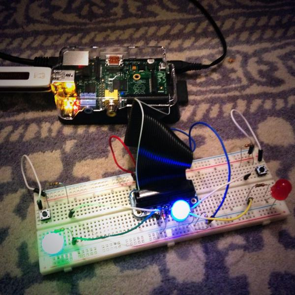

# Raspberry PI

This is where I'm going to dump stuff I make for the Pi.

To kick things off, a simple game, written in Go, that keeps track of which
player has the best response times.

The blue light pulses for a second at random intervals. The first player (green
or red) to hit their button wins the round. The player with the best score
over the last 10 rounds is the winner, and can be identified because their
light will be lit up.

